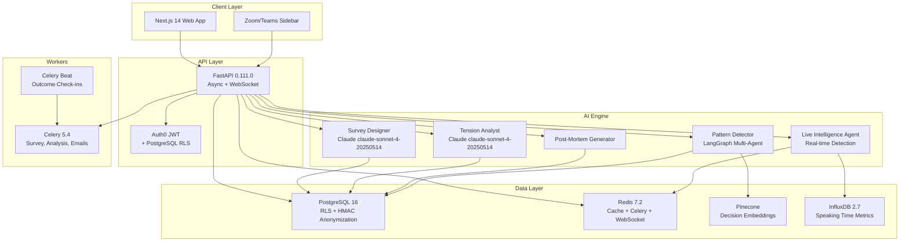

# QUORUM — Deep Project Analysis & Production Build Plan
## Collective Intelligence Platform | God-Tier Product Blueprint

---

## 1. Product Vision — The $37B Problem

Quorum is a **B2B AI platform** that makes organizational group decisions measurably better. Not faster meetings — **better decisions**.

> [!IMPORTANT]
> **Core Insight:** Every meeting AI tool built so far (Otter, Fireflies, Slido) solves efficiency. Quorum is the first to solve **decision quality** — a fundamentally different and more valuable problem.

### The Three Phases of Intelligence

| Phase | What Quorum Does | Value Delivered |
|-------|-----------------|-----------------|
| **Before** | Anonymous AI-generated surveys → tension maps → facilitator briefs | Surfaces what people *think* but won't say in the room |
| **During** | Real-time HiPPO detection, groupthink alerts, missing perspective flags | Intervenes before bad dynamics ruin decisions |
| **After** | Decision capture → post-mortems → 30/90/180 day outcome tracking | Builds irreplaceable Group Intelligence Profile |

### The Moat (This Is What Makes It Investable)
- **3 months:** Knows your team's patterns
- **12 months:** Predicts which decisions will be wrong
- **24 months:** Group Intelligence Profile is irreplaceable — switching means losing years of calibrated decision history

---

## 2. Technical Architecture Deep Dive

### Backend Stack (Python 3.12 + FastAPI)



### Key Architecture Decisions

| Decision | Rationale | Risk |
|----------|-----------|------|
| **PostgreSQL RLS** for multi-tenancy | DB-level isolation — app can't bypass | Low — battle-tested |
| **HMAC-SHA256** anonymization | One-way, meeting-scoped, irreversible | Low — cryptographically proven |
| **Claude claude-sonnet-4-20250514** as primary LLM | Best structured reasoning, Instructor compatible | Medium — vendor lock-in |
| **Instructor** for all LLM calls | Forces Pydantic schemas, eliminates JSON fragility | Low |
| **Deepgram Nova-2** for STT | 300-400ms latency, best meeting audio accuracy | Low |
| **Pinecone** for vector search | Managed, serverless free tier, migrate to pgvector at Series B | Low |

### Privacy Model — The Differentiator

| Data | Protection Method |
|------|-------------------|
| Survey responses | One-way HMAC hash at collection — mathematically irreversible |
| Speaker identity | Anonymous hash, meeting-scoped, resets each meeting |
| Individual performance | **Never stored, never surfaced** — product principle |
| Org data | Deleted within 24hrs on request via single API call |
| Audio recordings | Off by default, org opt-in, deleted after 30 days |

---

## 3. Security Posture Assessment

> [!TIP]
> This project has **exceptional** security design for a seed-stage startup. SOC 2 Type II readiness is baked into the architecture, not bolted on.

### SOC 2 Controls Coverage: **Complete**
- CC1 (Control Environment) ✅
- CC2 (Communication) ✅
- CC3 (Risk Assessment) ✅
- CC6 (Access Control) ✅ — Auth0 + RLS + RBAC
- CC7 (System Operations) ✅ — Full incident response
- CC8 (Change Management) ✅ — PR-based deploys
- CC9 (Risk Mitigation) ✅ — Multi-AZ, cross-region backup

### Threat Model Coverage
- T1: De-anonymization → HMAC + no lookup table + RLS + audit logs
- T2: LLM prompt injection → data/system prompt separation + Pydantic validation
- T3: API credential theft → AWS Secrets Manager + TruffleHog CI scanning
- T4: SQL injection → SQLAlchemy ORM + Pydantic input validation
- T5: Zoom meeting infiltration → Meeting-scoped, validated join URLs
- T6: Cross-org data access → JWT + RLS + org_id filters (defense in depth)

---

## 4. Business Model Analysis

| Tier | Price | Target |
|------|-------|--------|
| **Starter** | $49/seat/mo | Teams testing decision intelligence |
| **Growth** | $99/seat/mo | Orgs with 10+ meetings/month |
| **Enterprise** | Custom | SAML SSO, dedicated support, custom integrations |

**Month 12 Target:** 50 paying orgs, $180K ARR, 3 enterprise pilots, 500+ tracked decisions

---

## 5. Frontend Screens Required (UI Build Plan)

### Phase 1: Core Product (Launch-Ready)

1. **Landing/Marketing Page** — Premium conversion engine
2. **Dashboard** — Org overview with meeting list, decision stats
3. **Meeting Creation Flow** — Create meeting, add participants, configure survey
4. **Survey Interface** — Anonymous, no-login-required survey form
5. **Facilitator Brief** — Tension map visualization, suggested questions
6. **Decision Capture** — Tag decisions from meetings
7. **Decision Library** — Search and browse past decisions
8. **Settings/Admin** — Org settings, billing, user management
9. **Login/Auth Flow** — Auth0 integration

### Phase 2: Live Intelligence

10. **Live Meeting Sidebar** — Real-time alerts, speaking distribution
11. **Post-Meeting Report** — Post-mortem with key assumptions

### Phase 3: Intelligence Profile

12. **Group Intelligence Dashboard** — Radar charts, accuracy trends, blind spots
13. **Outcome Tracking** — 30/90/180 day check-ins

---

## 6. Build Sequence (Production-Ready)

```
Week 1:   Landing Page + Auth Flow + Dashboard Shell
Week 2:   Meeting Creation + Survey Interface
Week 3:   Facilitator Brief + Tension Map Visualization
Week 4:   Decision Capture + Decision Library
Week 5:   Settings + Admin + Billing Integration
Week 6:   Live Meeting Sidebar + Post-Meeting Report
Week 7:   Group Intelligence Dashboard + Outcome Tracking
Week 8:   Polish, Performance, Accessibility, Launch Prep
```

---

## 7. Critical Constraints

> [!WARNING]
> **Non-Negotiable Rules from the Specification:**
> 1. Never call Claude directly without Instructor — raw JSON parsing is a production disaster
> 2. RLS must be enabled before ANY production data enters the system
> 3. Anonymization HMAC secrets must NEVER be stored in the database
> 4. 80% test coverage enforced in CI — not optional
> 5. No `# type: ignore` in mypy without justification
> 6. All AI prompts must have evaluation suites — "prompts are code"

---

*Analysis generated from 20 project files totaling 230K+ bytes of specifications*
